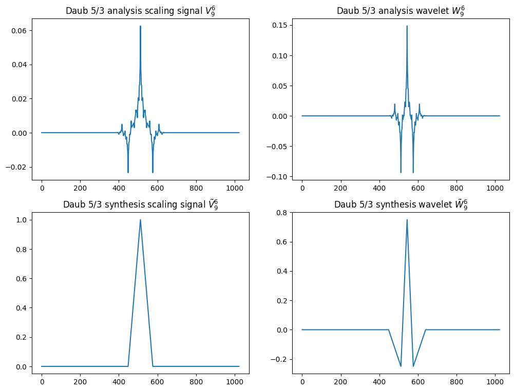
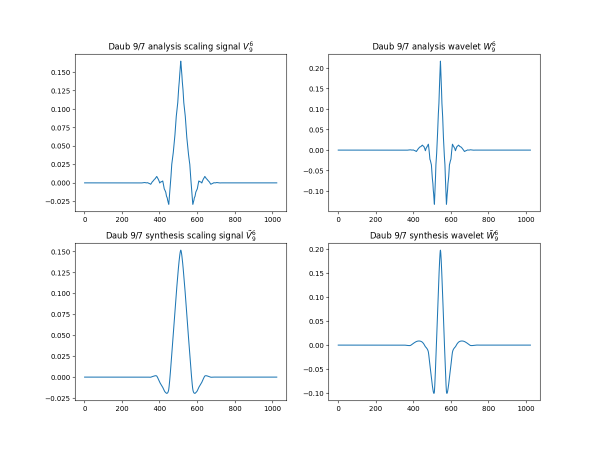
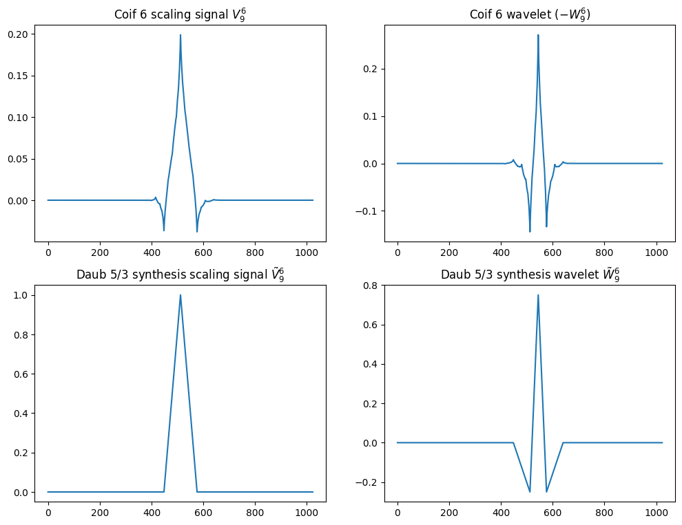

# Biorthogonal wavelets

## Описание

В качестве базовой принята схема преобразований из книги [1].

## Пользовательские функции
- [wave_vect(N, K, wave_type)](/Functions/wave_vect.py) - функция возвращает векторы анализа и синтеза уровня $K$:
    - analysis scaling signals ${V^K}$;
    - analysis wavelets ${W^K}$;
    - synthesis scaling signals ${\tilde{V}^K}$;
    - synthesis wavelets ${\tilde{W}^K}$.

Поддерживаются следующие системы функций:
- wave_type=[daub_5_3](/Functions/daub_5_3.py)
- wave_type=[daub_9_7](/Functions/daub_9_7.py)
- wave_type=[coif_6](/Functions/coif_6.py)

В случае небиортогональных систем соответствующие функции анализа и синтеза одинаковы, т.е. ${V^K=\tilde{V}^K}$, ${W^K=\tilde{W}^K}$.

## Примечания
Пришлось изменить знак.

## Reference
1. James S. Walker. A Primer on Wavelets and Their Scientific Applications. 2nd Edition. 2008.