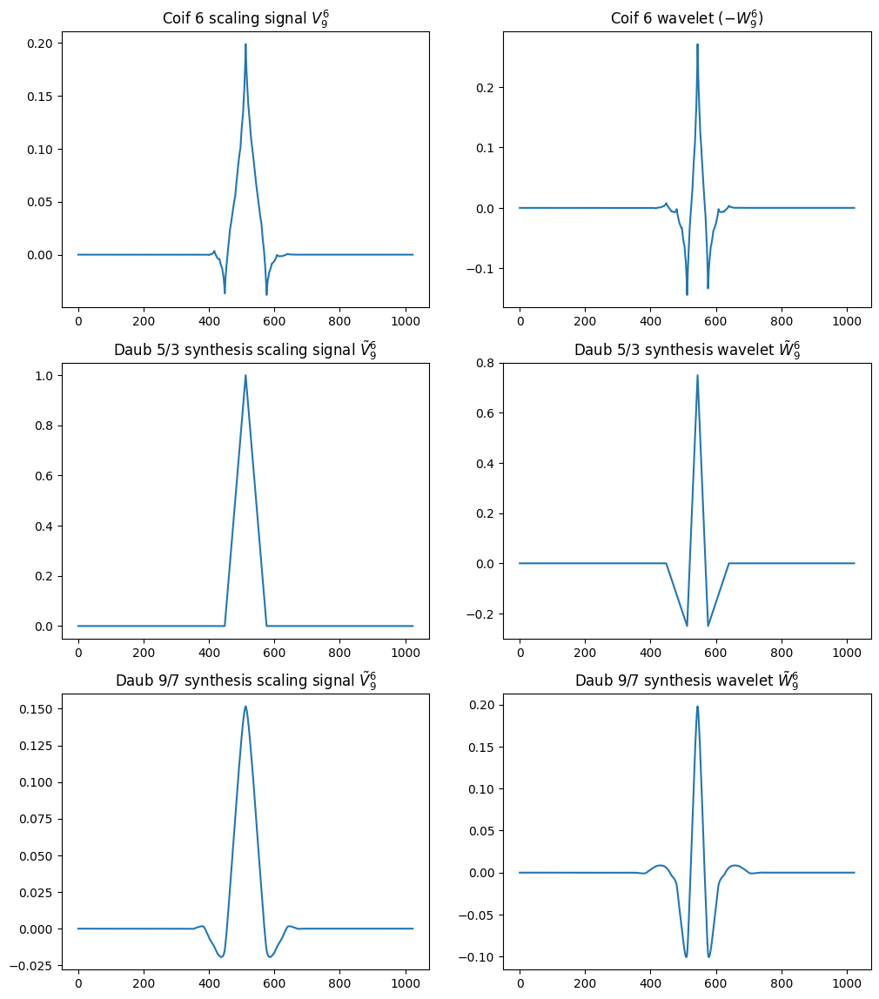
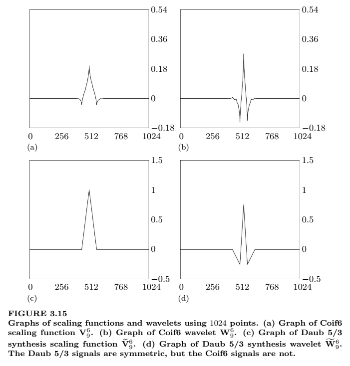
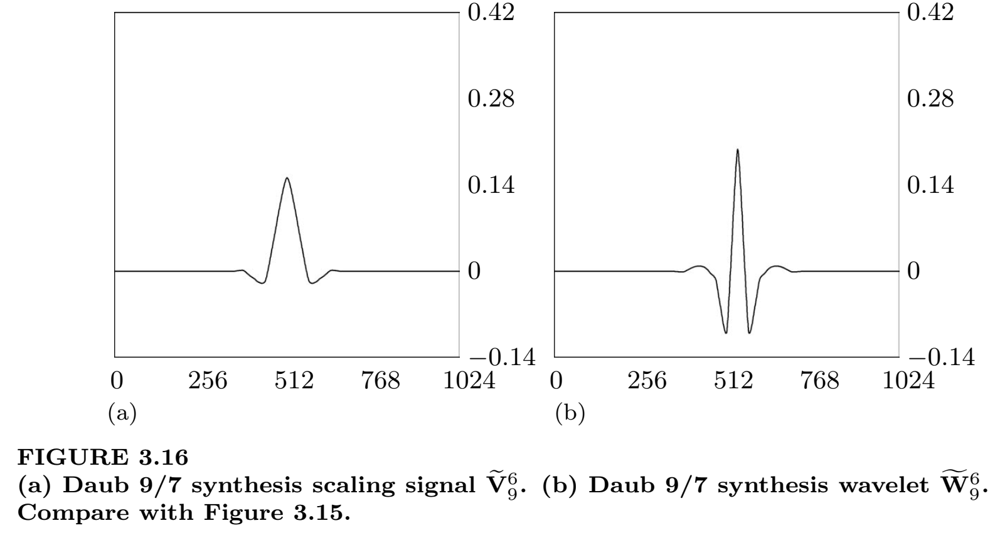

# Biorthogonal wavelets

## Описание
Реализовано вычисление масштабирующих функций и вейвлет-функций биортогонального типа уровня ${K}$. Верификация результатов выполнена путем сравнения графиков с приведенными в книге [1].

### Coif 6 ${V_9^6}$, ${W_9^6}$ vs Daub 5/3 and Daub 9/7 ${\tilde{V}_9^6}$, ${\tilde{W}_9^6}$

#### Figure 3.15 из книги [1]

#### Figure 3.16 из книги [1]

## Примечания
1. В случае небиортогональных систем (в том числе Coif 6) соответствующие функции анализа и синтеза одинаковы, т.е. ${V^K=\tilde{V}^K}$, ${W^K=\tilde{W}^K}$.
2. При построении вейвлет-функции ${W_9^6}$ системы Coif 6 потребовалось изменить знак: ${W_9^6 \rightarrow (-W_9^6)}$.

## Перечень основных файлов
- [transform.ipynb](transform.ipynb) - блокнот с построением графиков масштабирующих функций и вейвлет-функций.

## Пользовательские функции
[wave_vect(N, K, wave_type)](/Functions/wave_vect.py) - функция возвращает векторы анализа и синтеза уровня ${K}$:
- analysis scaling signals ${V^K}$;
- analysis wavelets ${W^K}$;
- synthesis scaling signals ${\tilde{V}^K}$;
- synthesis wavelets ${\tilde{W}^K}$.

Поддерживаются следующие системы функций:
- wave_type=[daub_5_3](/Functions/daub_5_3.py)
- wave_type=[daub_9_7](/Functions/daub_9_7.py)
- wave_type=[coif_6](/Functions/coif_6.py)

## Reference
1. James S. Walker. A Primer on Wavelets and Their Scientific Applications. 2nd Edition. 2008.